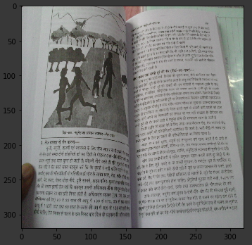
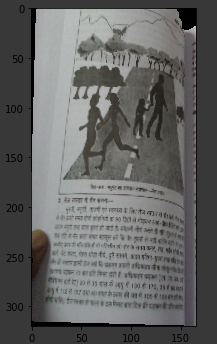
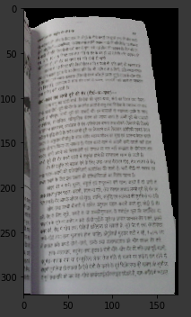
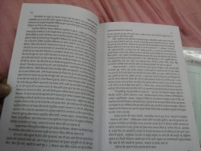
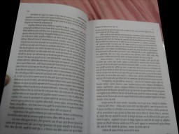
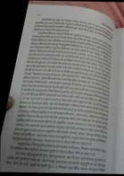
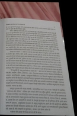

# BookImageSplitter
Converts list of 2 page images into 2 images for one page each.

## Using CNNs.
    

1. Using transfer learning, CNN is trained to do pixel segmentation of book area vs the background. [Notebook](./PagePixelSegmentation.ipynb)
2. Using transfer learning, CNN is trained to find out the mid line of the two pages. Mid line is the line which divides the left page from the right page. [Notebook](./PageMidBoundaryPixelSegmentation.ipynb)
3. Using weighted linear regression (with huber loss so as to ignore outliers), mid line is finetuned. This line is used both to rotate the image so that it becomes vertical in resulting image. Also, this is used to divide the image into left page and right page. [Notebook](./BookSegmentation.ipynb)

## TODO
1. Handle rough page edges. Make them smoothe.

## Using Traditional Computer Vision Techniques.
<!-- :---------: | :-----------: | ----------: -->
      

### How to use
`python run.py IMAGE_DIRECTORY`

In IMAGE_DIRECTORY, all images which needs to be separated into two should be present.

# TODO
1. Affine transformation on final output image so as to make the text horizontal.
2. Automatic detection of page numbers.
3. High resolution Pdf. Currently, low resolution pdf is getting formed.

